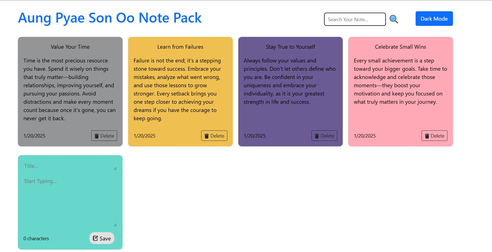

# 📌 React-Note-Pack

You can create beautiful and morden design note pack using this code

## 📸 Preview




---

## 📂 Project Structure
```
React-Note-Pack/
|-- node_modules
│-- public/
│-- src/
│   ├── components/  
│   │   ├── Header.jsx
│   │   ├── NewNote.jsx
|   |   ├── Note.jsx
|   |   ├── NoteList.jsx
│   ├── App.css
│   ├── App.jsx
│   ├── index.js
│-- index.html
│-- package-lock.json
│-- package.json
```

---

## 🚀 Installation Guide

1. Clone the repository:
   ```bash
   git clone https://github.com/AungPyaeSonOo/React-Note-Pack-Project.git
   ```
2. Navigate into the project folder:
   ```bash
   cd React-Note-Pack-Project
   ```
3. Install dependencies:
   ```bash
   npm install
   ```
4. Run the project:
   ```bash
   npm start
   ```

---

## 🍴 How to Fork This Project
1. Click the **Fork** button on the top right of this repository.
2. Clone the forked repository:
   ```bash
   git clone https://github.com/AungPyaeSonOo/React-Note-Pack-Project.git
   ```
3. Create a new branch for your changes:
   ```bash
   git checkout -b my-new-feature
   ```
4. Make your changes and commit them:
   ```bash
   git commit -m "Added my new feature"
   ```
5. Push the changes to your fork:
   ```bash
   git push origin my-new-feature
   ```
6. Create a **Pull Request**!

---

## 📬 Contact

If you have any questions or suggestions, feel free to reach out:
- **Email:** aungpyaesonoo002@gmail.com
- **GitHub:** [AungPyaeSonOo](https://github.com/AungPyaeSonOo)
- **LinkedIn:** [AungPyaeSonOo](www.linkedin.com/in/aung-pyae-son-oo-635761354)

---

⭐ If you like this project, give it a **star** on GitHub!
 
